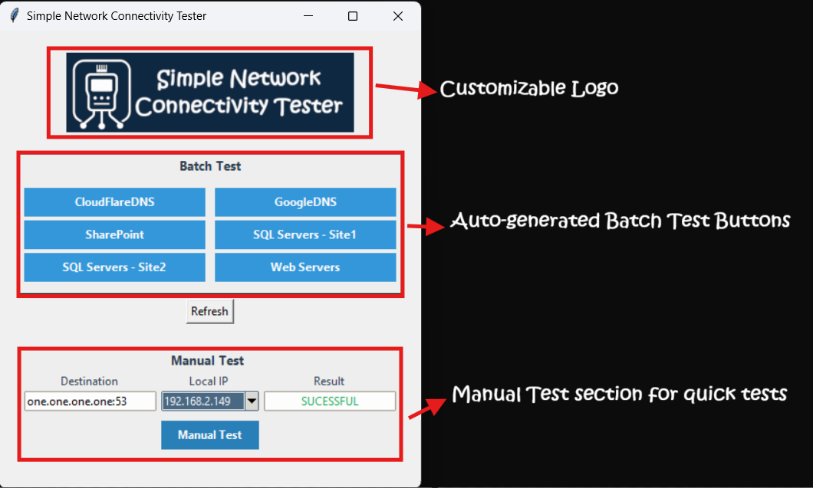
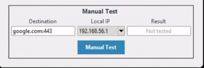
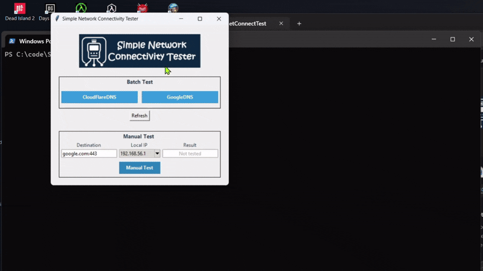
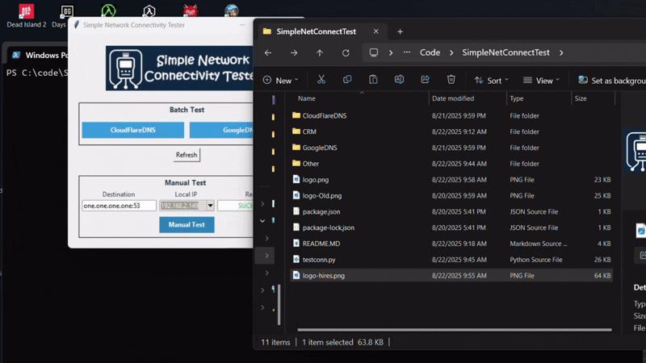

# Simple Network Connectivity Tester

Quickly check if your machine has connectivity to a remote server:port combination. Create subfolders with target services in a CSV file that will show up in the batch testing section.


## Features

- **Local IP selection**: Choose which local IP address to test from if your machine has multiple IPs. Handy if you are testing VPN vs local connectivity.

- **Manual testing**: Test to a single IP:port combinations directly from the main form

  

- **Batch-testing**: Create subfolders that contain a `ResourcesToCheck.csv` file with target resources to test. Perfect for quickly testing multiple related components of a larger solution.

  

- **Buttons generated based on Subfolder + CSV files**: The app detects subfolders that have the `ResourcesToCheck.csv` and dynamically generates Batch Test buttons when launched or refreshed.

  


- **Customizable logo**: Simply replace the logo.png file with the file of your choice.


## Example File Structure
To add more Batch Test buttons you would need to create a subfolder for each button and place the `ResourcesToCheck.csv` in it. The name of the subfolder will appear on the button.

Ensure that you edut the `ResourcesToCheck.csv` file to contain your serivces' details. Once done, click Refresh to show the new folder in the app. Folders are automatically refreshed on app restart.

```
├── testconn.py             # Main application file
├── logo.png             # You can add your own logo here!
└── [SQLServers-Site1]/
    └── ResourcesToCheck.csv  # All SQL Servers at site 1
└── [SQLServers-Site2]/
    └── ResourcesToCheck.csv  # All SQL Servers at site 2
└── [Web Servers]/
    └── ResourcesToCheck.csv  # All Web Servers
└── [CRM]/
    └── ResourcesToCheck.csv  # The CRM servers
```

## CSV Format

Each `ResourcesToCheck.csv` file should be stored in a subfolder. The subfolder should be named whatever you want your button for that subfolder to appear as. The CSV file should contain the following columns:

| Description | IP         | Port |
|-------------|------------|------|
| Example Service | 192.168.1.10 | 80   |
| Another Service | example.com  | 443  |

Example `ResourcesToCheck.csv`:
```csv
Description,IP,Port
Web Server,192.168.1.10,80
HTTPS Server,example.com,443
Database,172.16.0.5,5432
```


## Requirements

- Python 3.x / Tkinter (usually included with Python)
- Built-in modules: `socket`, `subprocess`, `csv`, `re`, `threading`, `os`


## How to Use

1. **Prepare Your Environment**
   - Create subfolders and place your CSV files in subfolders as described in the "Example File Structure" section
   - Ensure each CSV contains the required columns (`Description`, `IP`, `Port`)
   - Optionally, place an `logo.png` file in the same directory for the application logo. Try to keep it horizontally-aligned

2. **Run the Application**
   - Execute the Python script by running `python testconn.py` to launch the main window
   - The main window will automatically scan for subfolders containing CSV files
   - Each detected folder will display a button in the "CSV-Based Tests" section

3. **Perform Connectivity Tests**
   - Click any folder button to open its connectivity test window
   - Select a local IP address from the dropdown (optional)
   - Click "Test" to begin scanning destinations
   - Watch results appear in real-time in the table
   - Use "Stop" to cancel ongoing tests if needed

4. **Manual Testing**
   - Use the "Manual Test" section at the bottom of the main window
   - Enter destination in format `IP:Port` or `URL:Port` (e.g., `192.168.1.10:80`)
   - Select source IP from dropdown if needed
   - Click "Manual Test" to check connectivity


## Q/A 
- **Q:** I created a subfolder, but my buttons is not showing up

  **A:** Only subfolders that contain `ResourcesToCheck.csv` file will show up as buttons. Ensure that you've placed the CSV file in the folder.

- **Q:** Is ICMP Ping also tested?

  **A:** No, currently the app only does TCP-based tests to `<host>`:`<port>` targets.


- **Q:** Can we show other stats such as response times:

  **A:** Planning to do so in upcoming versions


- **Q:** Can we show service responses such as HTTP 401s or SQL auth responses

  **A:** Not really as this is meant to be a simple network-level tester.


